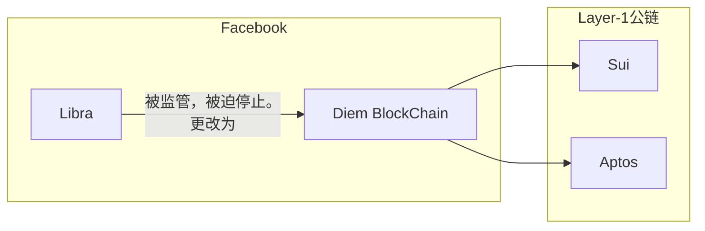

Move 是一种编程语言，基于 Rust 最初是为Libra区块链（后来更名为Diem）设计的。Move语言的设计目标是为区块链开发提供一种安全、高效的方式来编写智能合约。以下是Move开发语言的历史概述：

1. **Libra项目启动**：2019年，Facebook宣布了Libra项目，旨在创建一个新的全球金融系统。为了支持这个系统，需要一种新的编程语言来编写智能合约。

2. **Move语言的开发**：为了满足Libra项目的需求，Move语言被开发出来。它旨在提供一种更安全的方式来编写智能合约，特别是通过防止资产被复制或伪造。

3. **Move语言的特点**：Move语言的一些关键特性包括对资源类型的原生支持、模块化设计、以及一个安全的并行执行模型。

4. **开源**：Move语言的代码库在Libra项目的早期阶段就被开源了，允许社区参与和贡献。

5. **Libra到Diem的转变**：随着Libra项目面临监管挑战并最终更名为Diem，Move语言也继续发展，以适应项目的变化。

6. **Diem项目的结束**：尽管Diem项目最终没有实现其最初的愿景，但Move语言的开发并没有停止。

7. **Aptos Labs的成立**：2021年，一些Libra项目的前成员成立了Aptos Labs，并继续使用Move语言开发新的区块链平台Aptos。

8. **Move语言的持续发展**：Aptos Labs和其他社区成员继续改进Move语言，使其更加健壮和易于使用。

9. **社区和生态系统**：随着时间的推移，一个围绕Move语言的开发社区逐渐形成，许多开发者开始使用Move语言来构建区块链应用。

10. **多链支持**：Move语言也被设计为可以跨不同的区块链平台使用，增加了其灵活性和应用范围。

Move语言的发展历史展示了区块链技术如何不断演进，以及如何通过社区合作和开源开发来推动创新。随着区块链技术的普及，Move语言可能会在智能合约开发中扮演越来越重要的角色。
