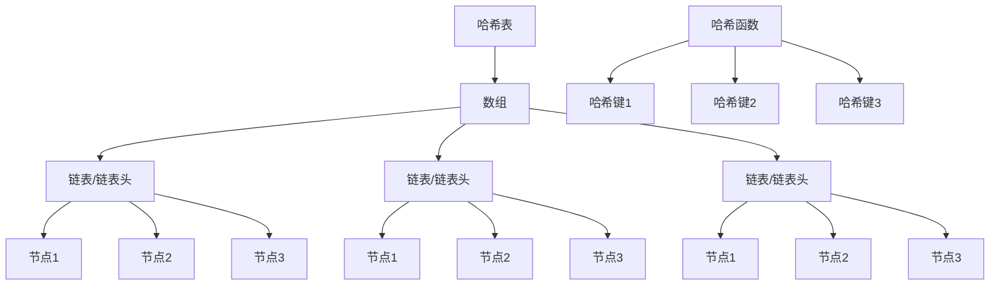

```mermaid
graph TD;
    A[哈希表] --> B[数组]
    B --> B1[链表/链表头]
    B1 --> B11[节点1]
    B1 --> B12[节点2]
    B1 --> B13[节点3]
    B --> B2[链表/链表头]
    B2 --> B21[节点1]
    B2 --> B22[节点2]
    B2 --> B23[节点3]
    B --> B3[链表/链表头]
    B3 --> B31[节点1]
    B3 --> B32[节点2]
    B3 --> B33[节点3]
    C[哈希函数]
    C --> C1[哈希键1]
    C --> C2[哈希键2]
    C --> C3[哈希键3]

```

# 实现思路

为了方便计算，数组大小设置为 `10`，那么下标索引就是 `0~9`，也就是除以 `10` 的取余范围

默认 `value` 为 `string`，所以：

1. 将字符串转为 `u64`，这里使用的是[[霍纳算法]]