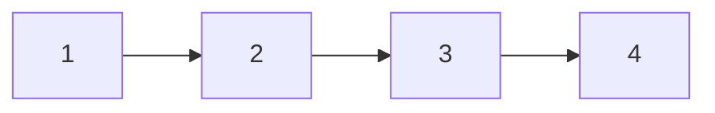
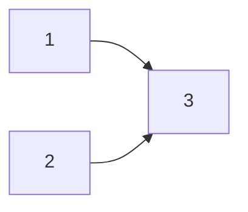
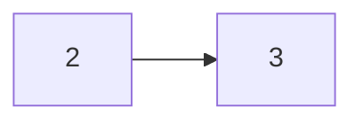

[数据结构与算法](https://www.runoob.com/data-structures/data-structures-tutorial.html#:~:text=数据结构是一种具有一定逻辑关系，在计算机中应用某种存储结构，并且封装了相应操作的数据元素集合%E3%80%82,它包含三方面的内容，逻辑关系、存储关系及操作%E3%80%82%20不同种类的数据结构适合于不同种类的应用，而部分甚至专门用于特定的作业任务%E3%80%82)


数组在内存中的表示：

假设在内存中要申请 16 个字节，那么会申请连续的 16 个字节，此时如果需要再放入 8 个字节，那么只能重新申请 24 个字节，然后把原来的 16 个字节拷贝过来，在加入新的 8 个字节

链表在内存中的表示：

假设在内存中要申请 16 个字节，那么会申请 16 个字节，他们可以不是连续的，如果下一次还需要申请任意大小的空间，那么它会再直接申请，而无需拷贝之前的内存空间。

链表的结构：




- 增加 1 到中间

    ```mermaid
    flowchart LR
      1
      2 --> 3
    ```
    
    ```mermaid
    flowchart LR
      1 --> 3
      2 --> 3
    ```
    
    ```mermaid
    flowchart LR
      1 --> 3
      2 --> 1
    ```

- 删除 1 

    ```mermaid
    flowchart LR
      1 --> 3
      2 --> 1
    ```
    



